# Screenshots & Report

## Report

In this folder, you are able to download the PDF of the report.

## Screenshots

Following, you will find all the screenshots:

###### No filtering

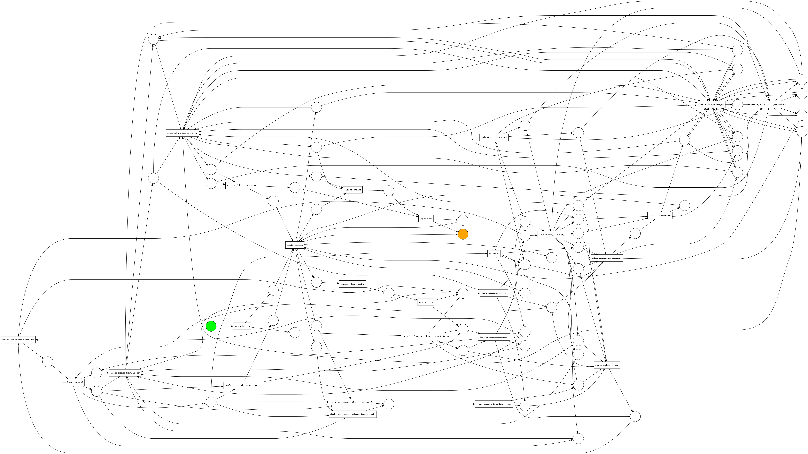

###### 0.5% filtering - 3259 left

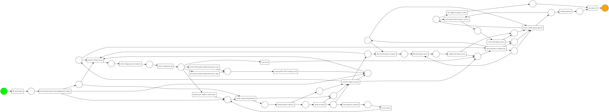

###### 2.5% filtering - 3200 left

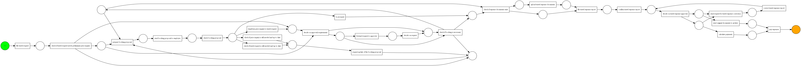

###### 5% filtering - 2983 left

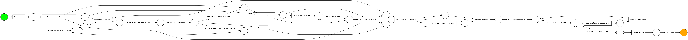

###### 10% filtering - 2734 left

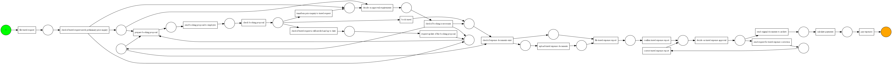

###### 15% filtering - 2453 left

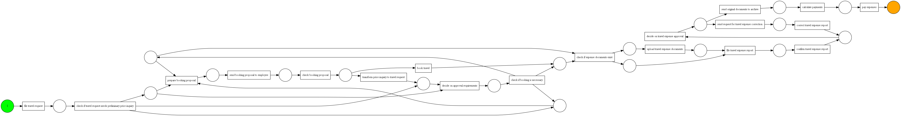

###### 20% filtering - 2123 left

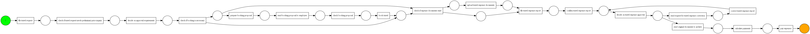

###### 35% filtering - 1029 left

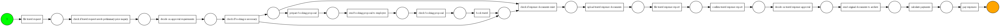

###### 45% filtering - 624 left

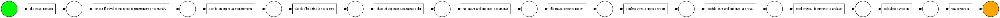

###### Celonis all Connections

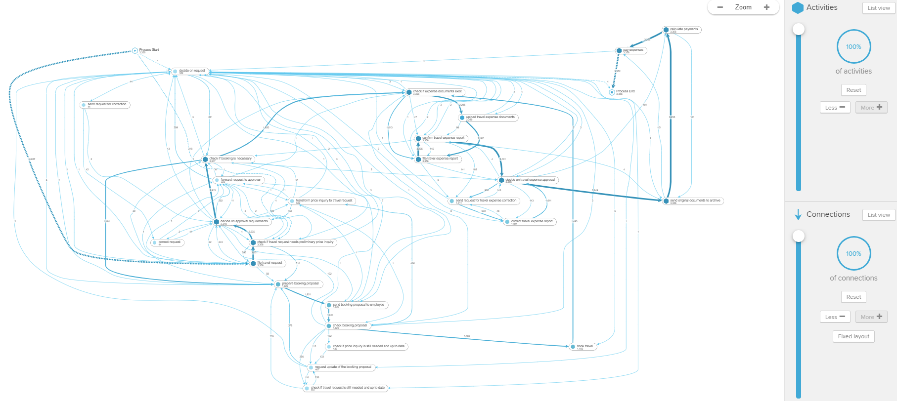

###### Celonis 92% Connection

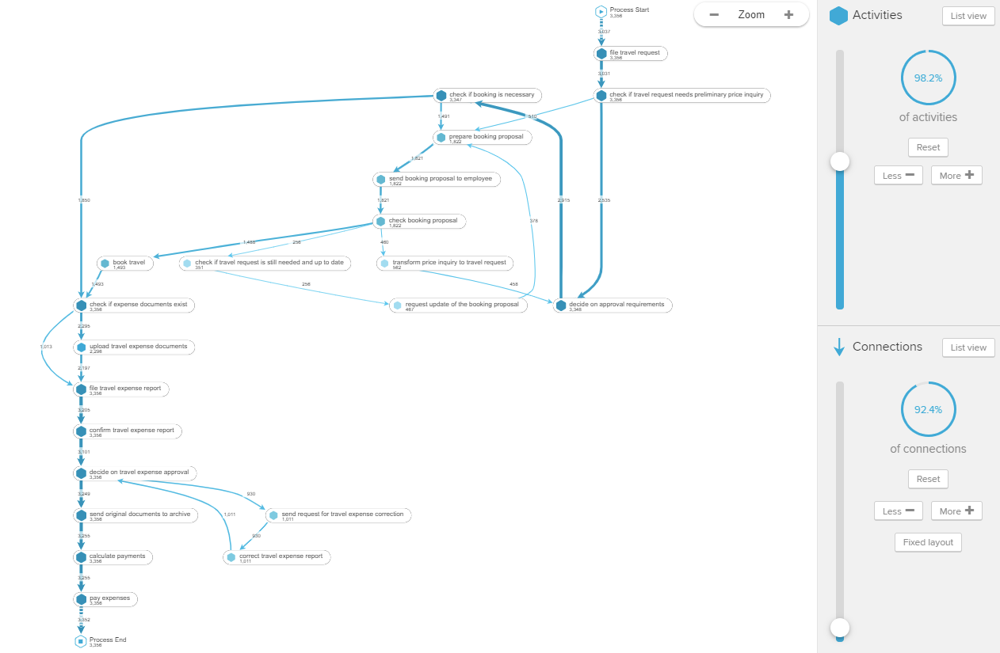

###### Celonis 90% Connection

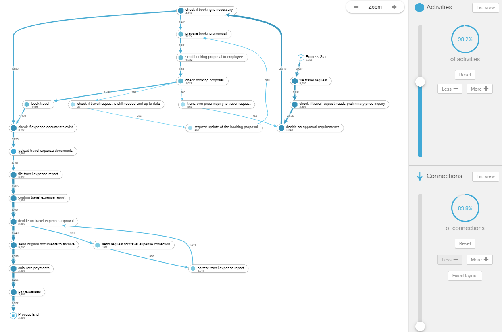
